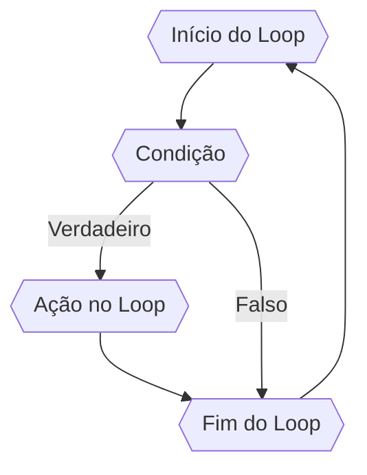

# Tomada de decisao

**Fundamental Theorem of Calculus**  
Let $f:[a,b] \to \R$ be Riemann integrable. Let $F:[a,b]\to\R$ be $F(x)=
\int_{a}^{x}f(t)dt$.
Then $$F$$ is continuous, and at all $x$ such that $f$ is continuous at $x$,
$F$ is differentiable at $x$ with $F'(x)=f(x)$.