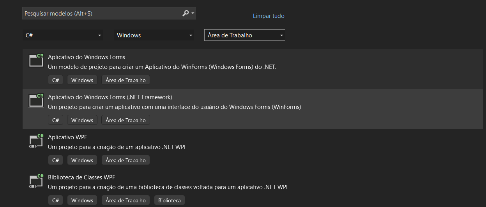

# Windows Forms e um Hello World

:::note
Para essa atividade é esperado que o aluno já tenha o Visual Studio Community instalado
:::

## Como criar um novo projeto

Abra o Visual Studio e crie um novo projeto do tipo **C# Windows**. Escolha a opção Área de Trabalho.

Será aberto algumas opções de escolha, devendo marcar a opção **Aplicativo do Windows Forms (.NET Framework)

